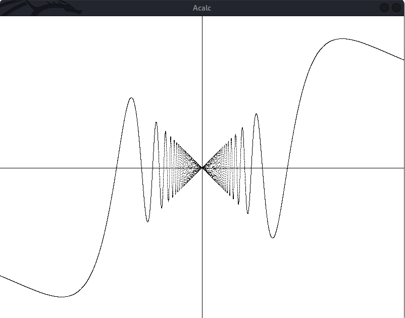

# Acalc2

## Advanced Calculator for Accelerated Learning Coders

Upgraded version of  Acalc re-written in C++ with added features.

Acalc was designed with the intent that programmers would gain the most from the application. That isn't too ssay that it can't be sued by people who aren't well versed with programming. it is, in fact, incredibly simple to set up and utilise.

## What it can do?
- Solve long mathematical expressions
- Supports trigonometric and logorithmic functions
- Do indefinite integration
- Plot Graphs

## How to build?
### Linux
    chmod +x build.sh
    ./build.sh
    
### Window
    mkdir build
    cd build
    cmake ..

## Running the application
### Linux
    ./build/bin/Acalc
### Window
    .\build\bin\Acalc
    
## Sample
### Console
    >> print sin(pi/2);
    1
    >> print 45+5/3^3+2-34*3/34*sin(pi/2)/2+log(32)*e;
    59.5505
    >> print integ(sin(x)*cos(x), 0, pi);
    4.86325e-08
### Using Graph
    >> show;
    >> graph x * sin(300 / x^2);
    

